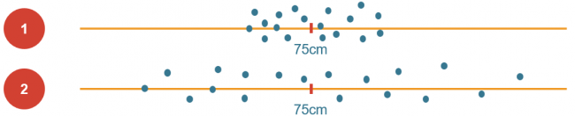

```{r setup, include=FALSE}
options(htmltools.dir.version = FALSE)
```

```{r xaringan-themer, include=FALSE, warning=FALSE}
library(xaringanthemer)
style_duo_accent(
  primary_color = "#1381B0",
  secondary_color = "#FF961C",
  inverse_header_color = "#FFFFFF"
)
```

# Retrospecto
- Mercado do Trabalho do Sec. XXI - 4ª Revolução Industrial   
- Sistema input-output   
- Perspectivas históricas e Fundamentos da Gestão da Qualidade   
- O que é qualidade?   
- Normalização e Normas ISO   
- Kaizen, PDCA, MASP   
- Ferramentas da Qualidade - 01   
- **Ferramentas da Qualidade - 02**

---
## Análise de varibilidade dos processos

- Medidas de tendência central
- Medidas de dispersão

```{r echo=FALSE, message=FALSE, fig.align="center", warning=FALSE, out.width="80%"}

```

---
## Causalidade x correlação

- Explicação
- Controle

.pull-left[
```{r echo=FALSE, message=FALSE, fig.align="center", warning=FALSE, out.width="80%"}

```
]

.pull-right[
```{r echo=FALSE, message=FALSE, fig.align="center", warning=FALSE, out.width="80%"}

```
]

---

```{r echo=FALSE, message=FALSE, fig.align="center", warning=FALSE, out.width="80%"}
knitr::include_graphics("./img/aulas-estatistica.png")
```

```{r echo=FALSE, message=FALSE, fig.align="center", warning=FALSE, out.width="80%"}

```

---

## Ferramentas para Gestão da Qualidade

- Folha de verificação   
- Estratificação   
- Gráfico de Pareto   
- Diagrama de causa e efeito   
- Histograma   
- Fluxograma   
- Diagrama de dispersão   
- Gráficos de controle   
- O ciclo PDCA   
- Brainstorming   
- 5S   
- 5W   
- 5W2H   

---

## Primeira atividade sobre o estudo de caso

#### Prazo para entrega desta atividade: 17/10/2020

1. Descreva o processo de entregas por meio de um **fluxograma**.
2. Explore as **características** das entregas em relação ao tempo, local de entrega e tipo de problema considerando as ocorrências e o custo envolvido nessas ocorrências.
3. Quais são os **problemas** mais relevantes para a empresa Rapidão Transportes? Explique como você **quantificou** o problema (métrica e unidade considerados)? Por que fez essa escolha?
4. O que serão os **próximos passos** para melhoria do processo?

---
## Algumas colocações pertinentes....

- diferenciar **produto final** de **serviço**. O processo de produção apresentado é uma prestação de serviços. 
- **Unidade** que possibilite ações orientadas à solução de problemas. "$"?     
- O ano de 2019 houve mais entregas assim houve também mais registro de avarias.   
- Funções organizacionais na estrutura do fluxograma
- Acúmulo de brinquedos no caminhão em uma só viagem?
- Contratação de colaboradores temporários? Realocação da equipe em período de maior demanda?
- Porque somente os produtos 1 e 5 estão tendo problemas de atraso e avarias?
- Como estão sendo dispostos os produtos que são danificados no caminhão?
- A quantidade empilhada está sendo respeitada?

---
.pull-left[
```{r echo=FALSE, message=FALSE, fig.align="center", warning=FALSE, out.width="100%"}

```
]

.pull-right[
```{r echo=FALSE, message=FALSE, fig.align="center", warning=FALSE, out.width="100%"}

```
]

---

## Algumas hipóteses de causas e possíveis soluções ....

- Implementar um responsável da qualidade para garantir a execução respeitando o limite seria interessante?
- É possível extrair dados sobre as ocorrências para cada produto, dados os fatores: Distância, Tempo de Entrega? 
- Diminuir a quantidade de caixas empilhadas;   
- Utilizar outros materiais para embalar melhor e amortecer os produtos;    
- Definir rotas onde os produtos com maior custo sejam entregues primeiro;    
- Utilizar veiculos de entrega menores, visando fazer rotas menores.   
- Investimento  em  sistemas  logísticos  e  treinamento  de  funcionários  para  reduzir o índice de atrasos. 
- Não transportar mais produtos do tipo p5
- Planejar deslocamento do transporte para buscar a mercadoria, saindo com antecedência
- Seguro de carga
- Coordenar estoque + transporte de maneira colaborativa.
 
---

## Outras impressões ....

- Ninguém fez um gráfico de Pareto para entender os problemas mais importantes. 
- Algumas métricas de estatística descritiva exploratória poderiam ter sido adotadas... 

```{r echo=FALSE, message=FALSE, fig.align="center", warning=FALSE, out.width="80%"}

```


---
## Segunda atividade sobre o estudo de caso

#### Prazo para entrega desta atividade: 27/10/2020

#### Duas semanas depois...

- prob1, avaria do produto;    
- prob2, atraso na entrega. 

- Retificação das ocorrências de prob1 sem que houvesse observações sobre avarias   

---
## Segunda atividade sobre o estudo de caso
#### Novas informações   
- **Leadtime** (36 horas)   
  - recebimento do pedido da fábrica com detalhes do transporte a ser realizado (time_ped);  
  - alocação de veículos e equipe de trabalho e deslocamento para coleta dos pedidos. Esse tempo é concomitante com aquele necessário para expedição do pedido pela fábrica (time_veic);   
  - carregamento dos veículos na fábrica (time_carga);    
  - viagem até o varejista. 

---
## Segunda atividade sobre o estudo de caso
#### Perguntas a serem respondidas:  

- Houve redução de **variabilidade** quando os dados foram estratificados? Explique e apresente elementos gráficos para auxiliar a explicação.   
- Considerando que você encontrou as características específicas do problema, para a etapa de **Análise** e **Plano de Ação**, quais os próximos **passos** a serem feitos e **ferramentas** que devem ser utilizadas?   

---
class: inverse, middle, center

# Temos atividade preliminar e checkpoint essa semana!

